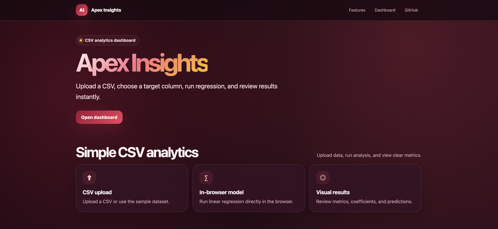
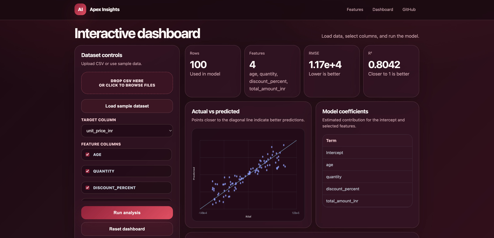
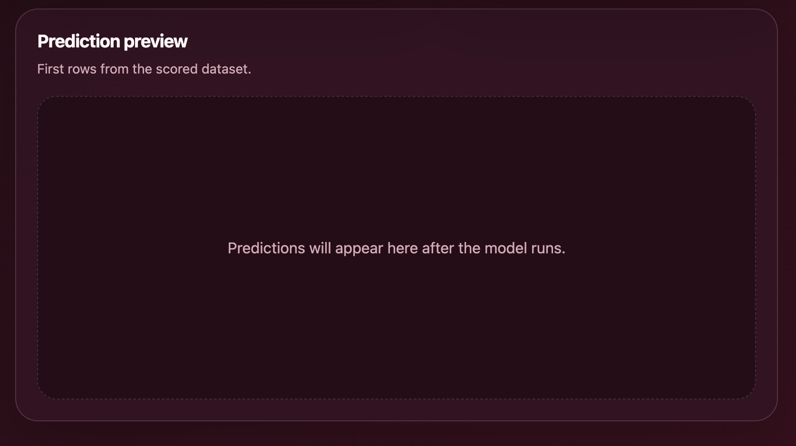

# Apex-Insights

A reproducible R analytics pipeline for reading raw CSV data, cleaning it, training a baseline linear regression model, generating predictions, and saving artifacts for downstream reporting.

## Preview







## Frontend Dashboard

This project now includes a static frontend in `public/index.html` for quick demos and portfolio deployment. The dashboard lets you:

- upload a CSV file directly in the browser
- load the bundled sample dataset
- choose a numeric target column and feature columns
- run a baseline linear regression in JavaScript
- view RMSE, MAE, R², coefficients, predictions, and an actual-vs-predicted chart

The frontend is dependency-free and works with the existing `vercel.json`, so it can be deployed as a static site on Vercel.

To preview it locally:

```bash
python3 -m http.server 3000 -d public
```

Then open:

```text
http://localhost:3000
```

## What The Project Does

The codebase currently implements these core steps:

1. **Read raw input** from `data/raw/input.csv`
2. **Clean the dataset** by:
   - normalizing column names with `janitor::clean_names()`
   - converting factor columns to character
   - trimming whitespace from character values
3. **Validate required columns** before modeling
4. **Train a linear regression model** using `stats::lm()`
5. **Score the model** on the available dataset
6. **Write artifacts** to disk as `.rds` files
7. **Render a report** with Quarto

## Pipeline Outputs

After a successful run, the main outputs are:

- `artifacts/models/model.rds` — trained model object
- `artifacts/data/preds.rds` — generated predictions

## Tech Stack

| Category | Technology |
| --- | --- |
| Programming Language | R |
| R Version | R 4.5.2 |
| Pipeline Orchestration | targets |
| Dependency Management | renv |
| Data Processing | tidyverse, dplyr, readr, stringr, janitor |
| Modeling | Base R stats, Linear Regression with `lm()` |
| Configuration | config, YAML |
| Logging | logger |
| Reporting | Quarto |
| Artifact Storage | RDS files |
| Testing | testthat |
| Linting | lintr |
| Frontend | HTML, CSS, Vanilla JavaScript |
| Dashboard Deployment | Vercel |
| CI/CD | GitHub Actions |
| Data Format | CSV |

## Project Structure

```text
Apex-Insights/
├── .github/
│   └── workflows/
│       └── ci.yml
├── artifacts/
│   ├── data/
│   │   └── preds.rds
│   ├── models/
│   │   └── model.rds
│   └── reports/
├── data/
│   ├── external/
│   └── raw/
│       └── input.csv
├── images/
│   ├── apex-insights-preview-1.png
│   ├── apex-insights-preview-2.png
│   └── apex-insights-preview-3.png
├── public/
│   └── index.html
├── R/
│   ├── clean.R
│   ├── features.R
│   ├── io_read.R
│   ├── io_write.R
│   ├── logging.R
│   ├── model_score.R
│   ├── model_train.R
│   ├── utils.R
│   └── validate.R
├── renv/
│   └── activate.R
├── reports/
│   ├── sections/
│   └── report.qmd
├── scripts/
├── tests/
│   ├── testthat/
│   │   ├── helper-source.R
│   │   ├── test-clean.R
│   │   └── tests/
│   │       └── testthat/
│   │           └── test-model-train.R
│   └── testthat.R
├── .gitignore
├── .lintr
├── .mailmap
├── .Rprofile
├── _targets.R
├── config.yml
├── LICENSE
├── README.md
├── renv.lock
└── vercel.json
```

## Requirements

- **R** 4.x or later
- **renv** for restoring the project library
- **Quarto** for report rendering

On macOS with Homebrew:

```bash
brew install r quarto
```

## Getting Started

### 1. Clone the repository

```bash
git clone https://github.com/alokpriyadarshii/Apex-Insights.git && cd Apex-Insights
```

### 2. Restore project dependencies

```bash
R --vanilla -q -e 'if (!requireNamespace("renv", quietly = TRUE)) install.packages("renv", repos = "https://cloud.r-project.org"); renv::restore()'
```

### 3. Run tests

```bash
R --vanilla -q -e 'renv::load(); testthat::test_dir("tests/testthat")'
```

### 4. Run the pipeline

```bash
R --vanilla -q -e 'renv::load(); targets::tar_make()'
```

### 5. Verify generated artifacts

```bash
ls -1 artifacts/models/model.rds artifacts/data/preds.rds
```

### 6. Render the report

```bash
quarto render reports/report.qmd
```

Or from R:

```bash
R --vanilla -q -e 'renv::load(); quarto::quarto_render("reports/report.qmd")'
```

## Input Data Expectations

The default pipeline reads:

```text
data/raw/input.csv
```

The current training target is hardcoded as:

```text
y
```

All remaining columns are used as features.

Example input format:

```csv
y,x1,x2
-0.5604756466,2.1988103489,-0.0735560191
-0.2301774895,1.3124129764,-1.1686514244
1.5587083141,-0.2651450567,-0.6347482649
```

## Configuration

Project configuration is stored in `config.yml`.

Current defaults:

```yaml
default:
  artifacts: "artifacts"
  log_level: "INFO"
```

This controls:

- where generated artifacts are written
- the logging verbosity used during pipeline execution

## Testing And Quality Checks

The repository includes:

- **unit tests** in `tests/testthat/`
- **linting** for the `R/` directory
- **GitHub Actions CI** to run tests and linting on push and pull request events

Run lint locally with:

```bash
R --vanilla -q -e 'renv::load(); lintr::lint_dir("R")'
```

## Current Implementation Notes

This project is a strong starter template for reproducible analytics workflows, but the present implementation is intentionally minimal.

Current characteristics:

- modeling uses a **single linear regression** via `stats::lm()`
- scoring is done on the same available dataset
- validation checks only for required column presence
- `features.R` and `utils.R` are scaffold files for future expansion
- the Quarto report is a starter report and can be extended with plots, metrics, and interpretation

## Suggested Next Improvements

Good next steps for the project would be:

- add a train/test split or cross-validation
- introduce richer feature engineering in `R/features.R`
- track evaluation metrics such as RMSE, MAE, or R²
- add visualizations to the Quarto report
- parameterize the target column and input path
- add stronger schema and missing-value validation

