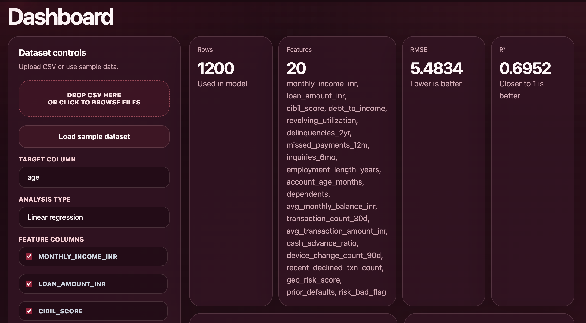
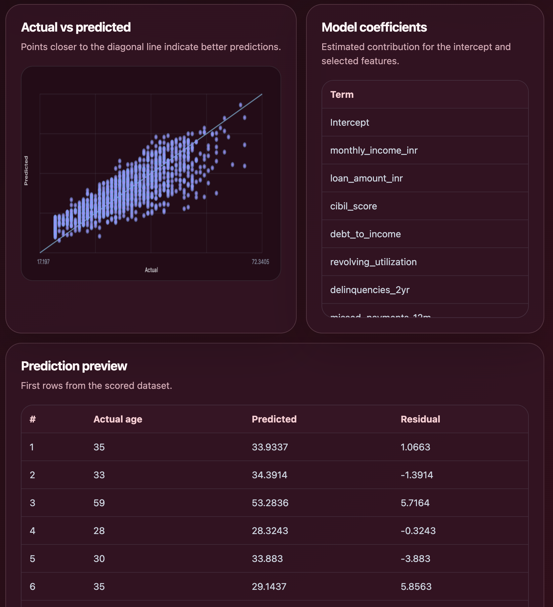

# Apex-Insights

A reproducible analytics and lakehouse project that combines the original R reporting workflow with a Python + PySpark data platform pipeline. It ingests finance style raw data, builds bronze/silver/gold datasets, writes optimized Parquet outputs, runs automated data quality controls, reconciles layer totals, and adds fraud/credit risk model validation with threshold tuning, score stability, feature importance, and review decision rules.

## Preview






## Frontend Dashboard

This project includes a static frontend in `public/index.html` for quick demos and portfolio deployment. The dashboard lets you upload a CSV file, load the bundled sample dataset, choose target and feature columns, run a baseline linear regression in JavaScript, and view metrics, coefficients, predictions, and an actual-vs-predicted chart.

Preview it locally:

```bash
python3 -m http.server 3000 -d public
```

Then open:

```text
http://localhost:3000
```

## What The Project Does

The codebase implements two complementary workflows:

1. **R analytics pipeline** for model training, scoring, artifact writing, and Quarto reporting.
2. **Python + PySpark lakehouse pipeline** for distributed data processing and finance-style data engineering.

The PySpark flow follows:

```text
raw data -> bronze layer -> silver layer -> gold/curated layer -> quality report -> analytics/report
```

Core PySpark capabilities:

- Ingests raw transaction CSV and customer JSON data.
- Builds bronze records with standardized timestamps, event dates, source metadata, and ingestion timestamps.
- Transforms valid records into clean silver datasets.
- Models customer profile history using SCD Type 2 with surrogate keys, validity ranges, current-record flags, and record hashes.
- Writes curated datasets in partitioned Parquet format for efficient downstream analytics.
- Generates automated data quality reports for completeness, accuracy, consistency, uniqueness, freshness, schema validation, and outlier monitoring.
- Adds reconciliation checks across raw, bronze, silver, and gold layers to verify record counts, amount totals, and rejected-record handling.

The original R workflow still reads `data/raw/input.csv`, cleans the dataset, validates required columns, trains a linear regression model with `stats::lm()`, scores predictions, writes `.rds` artifacts, and renders a Quarto report. It now also creates a demo binary risk flag from the starter target, trains a logistic-regression validation model, optionally trains Random Forest and XGBoost challengers when those packages are installed, and writes a model validation report.

## Pipeline Outputs

After a successful R pipeline run:

- `artifacts/models/model.rds` - trained model object
- `artifacts/data/preds.rds` - generated predictions
- `artifacts/reports/model_validation_report.md` - fraud/credit-risk validation report

After a successful PySpark pipeline run:

- `artifacts/lakehouse/bronze/transactions_parquet/`
- `artifacts/lakehouse/bronze/rejected_transactions_parquet/`
- `artifacts/lakehouse/silver/clean_transactions_parquet/`
- `artifacts/lakehouse/silver/customer_profile_history_parquet/`
- `artifacts/lakehouse/silver/transaction_monitoring_features_parquet/`
- `artifacts/lakehouse/gold/customer_risk_summary_parquet/`
- `artifacts/lakehouse/gold/monthly_revenue_summary_parquet/`
- `artifacts/reports/data_quality_report.json`
- `artifacts/reports/data_quality_report.md`
- `artifacts/reconciliation/reconciliation_report.csv`

## Tech Stack

| Category | Technology |
| --- | --- |
| Programming Language | R, Python |
| R Version | R 4.5.2 |
| Python Version | Python 3.10+ |
| Pipeline Orchestration | targets, Make |
| Dependency Management | renv, pip |
| Data Processing | PySpark, Spark SQL, tidyverse, dplyr, readr, stringr, janitor |
| Modeling | Base R stats, Linear Regression with `lm()`, Logistic Regression with `glm()`, optional Random Forest/XGBoost challengers |
| Configuration | config, YAML |
| Logging | logger |
| Reporting | Quarto, Markdown, JSON |
| Artifact Storage | Partitioned Parquet, RDS files |
| Testing | pytest, testthat |
| Linting | ruff, lintr |
| Frontend | HTML, CSS, Vanilla JavaScript |
| Dashboard Deployment | Vercel |
| CI/CD | GitHub Actions, Docker |
| Data Format | CSV, JSON, Parquet |

## Project Structure

```text
Apex-Insights/
├── .github/
│   └── workflows/
│       └── ci.yml
├── R/
│   ├── clean.R
│   ├── features.R
│   ├── io_read.R
│   ├── io_write.R
│   ├── logging.R
│   ├── model_score.R
│   ├── model_train.R
│   ├── model_validation.R
│   ├── utils.R
│   └── validate.R
├── src/
│   └── apex_insights/
│       ├── __init__.py
│       ├── __main__.py
│       ├── config.py
│       ├── ingest.py
│       ├── model.py
│       ├── pipeline.py
│       ├── quality.py
│       ├── reconcile.py
│       ├── transform.py
│       └── write.py
├── sql/
│   ├── 01_create_tables.sql
│   ├── 02_data_quality_checks.sql
│   ├── 03_reconciliation_checks.sql
│   ├── 04_customer_monthly_summary.sql
│   ├── 05_window_functions.sql
│   └── 06_optimization_notes.sql
├── data/
│   ├── external/
│   │   └── .gitkeep
│   └── raw/
│       ├── accounts.csv
│       ├── customers.json
│       ├── input.csv
│       ├── merchant_categories.csv
│       ├── risk_scores.csv
│       └── transactions.csv
├── tests/
│   ├── python/
│   │   └── test_pipeline_contract.py
│   ├── testthat/
│   │   ├── helper-source.R
│   │   ├── test-clean.R
│   │   ├── test-model-validation.R
│   │   └── tests/
│   │       └── testthat/
│   │           └── test-model-train.R
│   └── testthat.R
├── public/
│   └── index.html
├── images/
│   ├── apex-insights-preview-1.png
│   ├── apex-insights-preview-2.png
│   ├── apex-insights-preview-3.png
│   ├── apex-insights-preview-4.png
│   └── apex-insights-preview-5.png
├── artifacts/
│   ├── .gitkeep
│   ├── data/
│   │   ├── .gitkeep
│   │   └── preds.rds
│   └── models/
│       ├── .gitkeep
│       └── model.rds
├── renv/
│   ├── .gitignore
│   └── activate.R
├── .Rprofile
├── .gitignore
├── .lintr
├── .mailmap
├── _targets.R
├── config.yml
├── Dockerfile
├── docker-compose.yml
├── LICENSE
├── Makefile
├── pyproject.toml
├── README.md
├── renv.lock
├── requirements.txt
└── vercel.json
```

## Runtime Generated Outputs

```text
artifacts/
├── data/
│   └── preds.rds
├── models/
│   └── model.rds
├── lakehouse/
│   ├── bronze/
│   ├── silver/
│   └── gold/
├── reports/
│   ├── data_quality_report.json
│   ├── data_quality_report.md
│   └── model_validation_report.md
└── reconciliation/
    └── reconciliation_report.csv
```

## Generated Outputs

```text
artifacts/
├── data/
│   └── preds.rds
├── models/
│   └── model.rds
├── lakehouse/
│   ├── bronze/
│   ├── silver/
│   └── gold/
├── reports/
│   ├── data_quality_report.json
│   ├── data_quality_report.md
│   └── model_validation_report.md
└── reconciliation/
    └── reconciliation_report.csv
```

## Requirements

- **R** 4.x or later
- **renv** for restoring the R project library
- **Quarto** for report rendering
- **Python** 3.10 or later
- **Java** 17 or later for PySpark

On macOS with Homebrew:

```bash
brew install r quarto openjdk@17
```

## Getting Started

### 1. Clone the repository

```bash
git clone https://github.com/alokpriyadarshii/Apex-Insights.git && cd Apex-Insights
```

### 2. Restore R dependencies

```bash
R --vanilla -q -e 'if (!requireNamespace("renv", quietly = TRUE)) install.packages("renv", repos = "https://cloud.r-project.org"); renv::restore()'
```

### 3. Install Python dependencies

```bash
python -m pip install -r requirements.txt
```

### 4. Run tests and linting

```bash
R --vanilla -q -e 'renv::load(); testthat::test_dir("tests/testthat")'
R --vanilla -q -e 'renv::load(); lintr::lint_dir("R")'
python -m pytest
python -m ruff check src tests/python
```

### 5. Run the R pipeline

```bash
R --vanilla -q -e 'renv::load(); targets::tar_make()'
```

### 6. Run the PySpark lakehouse pipeline

```bash
python -m apex_insights.pipeline
```

Or:

```bash
make pipeline
```

### 7. Verify generated artifacts

```bash
ls -1 artifacts/models/model.rds artifacts/data/preds.rds
make validate-parquet
```

### 8. Render the report

```bash
quarto render reports/report.qmd
```

Or from R:

```bash
R --vanilla -q -e 'renv::load(); quarto::quarto_render("reports/report.qmd")'
```

## Input Data Expectations

The original R pipeline reads:

```text
data/raw/input.csv
```

The current training target is hardcoded as:

```text
y
```

The PySpark lakehouse pipeline reads finance-style sample data from:

```text
data/raw/transactions.csv
data/raw/customers.json
data/raw/accounts.csv
data/raw/merchant_categories.csv
data/raw/risk_scores.csv
```

The transaction/customer flow is structured to demonstrate raw, refined, and curated datasets for analytics, reporting, monitoring, and AI use cases.

## SQL Analytics

The `sql/` folder contains ANSI-style SQL examples for table creation, data quality checks, reconciliation checks, monthly customer summaries, window functions, and optimization notes. These queries make the SQL troubleshooting and analytics layer visible alongside the executable PySpark implementation.

## Data Quality And Reconciliation

Implemented automated controls for:

- Completeness: no missing `customer_id`, `transaction_id`, or `amount`
- Accuracy: non-negative amounts, valid currency codes, valid timestamps
- Consistency: customer IDs exist in the customer profile table
- Uniqueness: transaction IDs are unique
- Freshness: latest transaction date is within the expected range
- Schema: expected columns and data types are present
- Outliers: unusually high transaction amounts are flagged for review

Reconciliation checks verify:

- raw transaction count equals bronze transaction count
- bronze valid records plus rejected records equals raw records
- silver amount totals match bronze valid amount totals
- gold monthly aggregates reconcile with silver transactions

## Fraud And Credit-Risk Model Validation

The R workflow includes a reusable validation layer in `R/model_validation.R` for binary fraud, default, or credit-risk targets. The starter dataset only contains a continuous `y` column, so the targets pipeline creates a demonstration `fraud_flag` by marking observations at or above the median as high risk. If a real 0/1 risk label is supplied, the same functions validate it directly.

Validation capabilities:

- Logistic Regression baseline with `stats::glm()`
- optional Random Forest challenger when `randomForest` is installed
- optional XGBoost challenger when `xgboost` is installed
- ROC-AUC, PR-AUC, KS score, and PSI
- confusion matrix metrics across tuned thresholds
- threshold tuning using F1 by default
- feature importance output for supported models
- approve, investigate, and reject decision rules
- Markdown validation report written to `artifacts/reports/model_validation_report.md`

## Performance Optimization

The PySpark pipeline partitions transaction Parquet datasets by `event_date` and gold summaries by `month`, broadcasts small dimension tables, caches reused Spark DataFrames, selects only required columns for downstream outputs, and keeps denormalized gold tables for repeated analytics queries. Additional notes are in `docs/performance_optimization.md`.

## Docker

Run the PySpark pipeline in a container:

```bash
docker compose up --build lakehouse
```

Generated outputs are mounted back into `artifacts/`.

## CI/CD

GitHub Actions runs:

- Python dependency installation
- `python -m ruff check src tests/python`
- `python -m pytest`
- `python -m apex_insights.pipeline`
- generated Parquet and report validation with `make validate-parquet`
- R tests and R linting

## Current Implementation Notes

This project now demonstrates both analytics workflow fundamentals and data platform engineering:

- the R pipeline keeps the original reproducible model/report workflow
- fraud/credit-risk validation adds Logistic Regression, optional Random Forest/XGBoost, ROC-AUC, PR-AUC, KS score, PSI, confusion matrix, threshold tuning, feature importance, and reject/investigate rules
- the PySpark pipeline adds bronze/silver/gold lakehouse layers, partitioned Parquet outputs, automated data quality, reconciliation, and SCD Type 2 customer history
- SQL files show practical querying, troubleshooting, window functions, and optimization patterns
- CI validates the Python pipeline outputs on every push and pull request

## Suggested Next Improvements

Good next steps for the project would be:

- add cross-validation folds for challenger model comparison
- introduce richer feature engineering in `R/features.R`
- add visualizations over the generated gold Parquet datasets
- parameterize the PySpark source and output paths for multiple environments
- add incremental load examples with file compaction and late-arriving data handling
